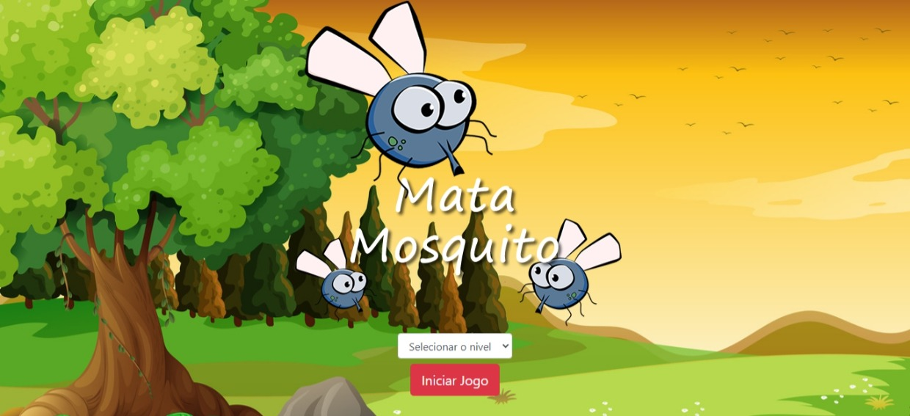

# App_mata_Mosquito

A aplicação consiste em uma "raquete" personalizada que usa o cursor do mouse como expoente, e algumas funções que fazem um mosquito aparecer randomicamente sob determinado tempo e quando você mata um é iniciada outra função pra salvar os pontos e remover o mosquito que você clicou, retomando ao loop de colocar outro mosquito em tela. O uso do setInterval é constante bem como a chamada de funções dentro de funções e recuperação desses parâmetros em outras páginas HTML.

## Tecnologias Utilizadas

HTML / CSS / JS
Bootstrap 4
Font awesome

